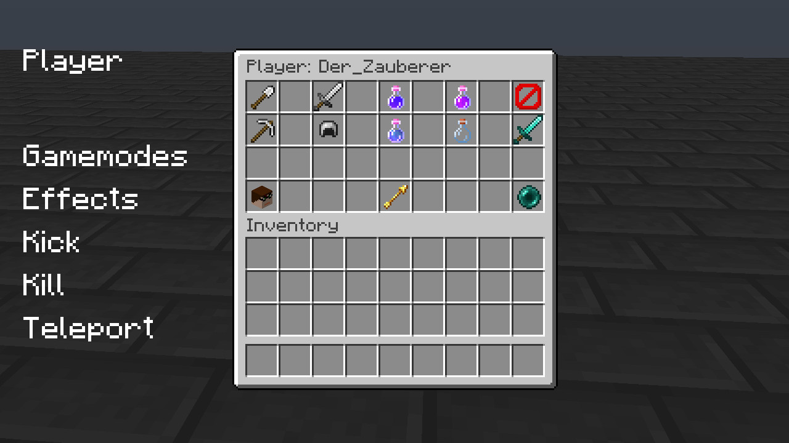
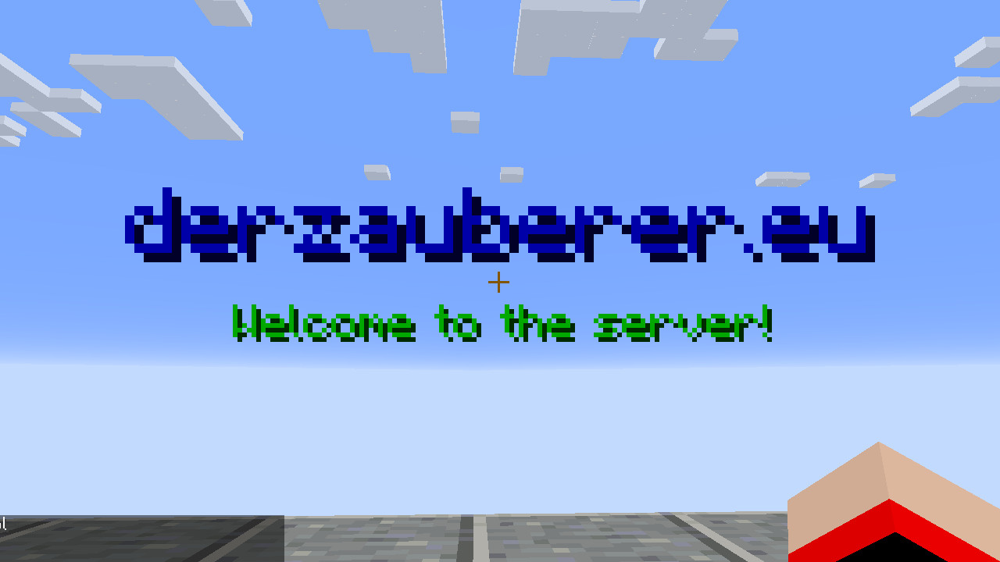
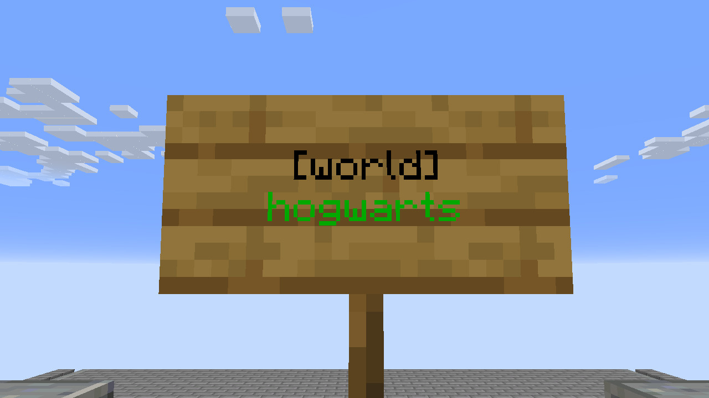

# ServerSystemPlugin

This is a bukkit plugin for permissions, multiworld, warps, lobby, clickable signs and admin tools.

## Features

- /admin command for sever and player settings
- /inventory command for seeing inventories of other players
- /enderchest command for seeing own or other players enderchest
- Protect worlds from grieving
- Set a position and world as lobby
- Vanish 
- Player groups with permissions (like PermissinsEx)
- Colored names in tablist and chat
- Different inventories in each world with world groups or same inventories for specific worlds

## Develpement and Version

API Version: *1.14.x - 1.19.x*<br>
Plugin Version: *v3.0*<br>
Java Class Version: *52 (Java8)*<br>

## Commands

|Command|Usage|Permission|Default Permission|Description|
|---|---|---|---|---|
|admin|`/admin`|`serversystem.command.admin`|false|Open the admin menu|
|build|`/build [<player>]`|`serversystem.command.build`|false|Allow the player to build in protected worlds|
|enderchest|`/enderchest [<player>]`|`serversystem.command.enderchest`|false|Open the enderchest of a player|
|group|`/group [<group>] [<action>] [<option>] [value]`|`serversystem.command.group`|false|Edit permission groups|
|inventory|`/inventory [<player>]`|`serversystem.command.inventory`|false|Open the inventory of a player|
|lobby|`/lobby`|`serversystem.command.lobby`|true|Teleport player to lobby|
|permission|`[<player>] [<option>] [value]`|`serversystem.command.permission`|false|Set the permissions and group of a player|
|permissionreload|`/permissionreload`|`serversystem.command.permission`|false|Reloads all permissions for all players|
|speed|`/speed`|`serversystem.command.speed`|false|Toggle players flyspeed|
|vanish|`/vanish [<player>]`|`serversystem.command.vanish`|false|Allow the player to vanish|
|warp|`[/warp <warp>] [<action>] [<option>] [value]`|`serversystem.command.warp` `serversystem.command.warp.edit`|true|Teleport player to a warp or edit a warp|
|world|`/world [<world>] [<action>] [<option>] [value]`|`serversystem.command.world` `serversystem.command.world.edit`|false|Teleport player to an other world or edit an other world|

The commands `world` and `warp` can be used to teleport with `serversystem.command.world` and `serversystem.command.warp`. The edit the warps and worlds use the same command, but with the permissions `serversystem.command.world.edit` and `serversystem.command.warp.edit`.

## Permissions
|Permission|Default|Description|
|---|---|---|
|`serversystem.command.admin`|op|Open the admin inventory|
|`serversystem.command.build`|op|Allow the player to build in protected worlds|
|`serversystem.command.build.other`|op|Allow other players to build in protected worlds|
|`serversystem.command.enderchest`|op|Open the enderchest of a player|
|`serversystem.command.group`|false|Edit permission groups|
|`serversystem.command.inventory`|op|Open the inventory of a player|
|`serversystem.command.lobby`|true|Teleport player to lobby|
|`serversystem.command.permission`|false|Set the permissions and group of a player|
|`serversystem.command.speed`|op|Toggle players fly speed|
|`serversystem.command.vanish`|op|Allow the player to vanish|
|`serversystem.command.warp`|op|Teleport player to a warp or edit a warp|
|`serversystem.command.world`|op|Teleport player to an other world or edit an other world|
|`serversystem.tools.adminstar`|op|Open the admin inventory with a nether star|
|`serversystem.tools.commandblock`|false|Allow to use command blocks|
|`serversystem.tools.disabledblocks`|op|Allow to use in the config disabled blocks|
|`serversystem.tools.signedit`|op|Allow to create clickable signs|

## Signs
You can create teleport signs to a world or warp. As long as you have the permissions `serversystem.tools.signedit` you can create such a sign. Make sure, that the label is in the second line and the name of the world or warp is in the third!

```
 [World]
worldname
```

```
 [Warp]
warpname
```

The color of the name will change to red or green, depending on availability of the warp or world. If you don't have the required permission the sign will change it's content to "Permission required!".

## Config
The config can be found at `/plugins/serversystem/plugin.yml` in your server folder.

### Disable messages for joining and leaving
You have the oportunity to disable the join- and leavemessage if you don't want to have minecraft's default messages for joining and leaving.

```json
join_message: false
quit_message: false
```

### Deal with world groups
You have the opportunity to enable the world groups. If they are enables worlds in the same world group share players inventories chat and tablist. Players, who are in different world with different world groups doesn't see each other in chat and tablist. This can also be changed with the global setting. The global settings do not have any impact if the world groups are disabled.

```json
enable_world_groups: true
global_chat_and_tablist: true
global_inventory: true
```

Every world, which is loaded has a configuration section with the entry `group`. Worlds are in one world group if they have the same group name. When a player switch to a world in the same worldgroup, he will keep his inventory and levels. If the world have a name, which no other world doesn't have, then the world has a separated inventory and experience levels.

```json
world:
    group: world
world_nether:
    group: world
hogwarts:
    group: hogwarts
```

In this example world and world_nether are in the same world group while the world hogwarts has his own separated world group.

### Disable vanilla portals
You can disable vanilla protals.

```json
enable_portals: false
```

### Lobby
You can set the lobby as main world of the server. You can go back with `/lobby`, `/hub`, `/l`, `/h` if you have the lobby enabled and if a user is connecting to the server, he will be spawn at the lobby world.

```json
lobby: true
lobby_world: world
```

### Welcome title
You welcome your server guest with your own title.

```json
title:
  text: derzauberer.eu
  color: dark_blue
subtitle:
  text: Welcome to the server!
  color: dark_green
```

You can use the colors codes listed in the [Minecraft Wiki](https://minecraft.gamepedia.com/Formatting_codes#Color_codes "Color Codes").

### Tablist text
You can add text above and below the names of the players in the tablist.

```json
tablist:
  title:
    text: derzauberer.eu
    color: blue
  subtitle:
    text: Welcome to the server!
    color: dark_green
```

You can use the colors codes listed in the [Minecraft Wiki](https://minecraft.gamepedia.com/Formatting_codes#Color_codes "Color Codes").

### Disable commands and default permissions
You can disable permissions simply by adding the permission to the list. For example, you can disable minecraft's default commands by adding it's permission. Permissions can't be shorted by using a `*`!

```json
disabled_permissions:
- bukkit.command.version
- bukkit.command.plugins
- bukkit.command.help
```

You can find minecraft standard commands in the [Bukkit Wiki](https://bukkit.gamepedia.com/CraftBukkit_Commands "Commands").

### Disable block
You can disable block. Players can not build an break them, even if they are in build mode. you need the `serversystem.tools.disabledblocks` permission if you want do break or place them. This does not work for entities.

```json
disabled_blocks:
- gravel
- minecraft:stone
```

### Worlds
You can load other worlds to your server, if there in your server directory. You can add a new world just by adding the world as a new section. The world 'world' and the subworlds 'world_nether' and 'world_the_end' are loaded by default. You can change the default world in the file `server.properties`.

All loaded worlds have own settings. <br>
`group` defines the world group of the world (more information at "Deal with world groups")<br>
`damage` players cant take damage from any source, if this is false<br>
`hunger` if this is false, player do not have to eat because they never lose saturation<br>
`pvp` players can't damage each other if this is false<br>
`explotion` explotions can't' break blocks, if this is false<br>
`protection` if this is true, blocks can't be removed or build until the player go in buildmode with '/build'<br>
`world_spawn` the player will always spawn at worldspawn if this is true, otherwise he would spawn at his spawnpoint<br>
`death_message` no chat message about a players death will appear, if you disable that<br>
`gamemode` the player will set in this gamemode, if the join to the world for the first time<br>
`permission` if set, a permission which is reqired to join this world<br>

```json
worlds:
  world:
    group: world
    damage: true
    hunger: true
    pvp: true
    explosion: true
    protection: false
    world_spawn: false
    death_message: true
    gamemode: 2
    permission: ''
  hogwarts:
    group: hogwarts
    damage: true
    hunger: true
    pvp: true
    explosion: true
    protection: false
    world_spawn: false
    death_message: true
    gamemode: 0
    permission: 'your.own.permission'
```

### Groups
The plugin have a permission system. If you don't want do use this add nothing to the groups. A player in a group will get all the groups permissions the colored prefix in front of the name if set. He will also get all permission from the groups parent group if set.

`priority` this defines the ranking in the tablist. The lower the number, the higher will the player shown in the tablist (1: highest 99:lowest)<br>
`color` The name of the player in that group will be colored<br>
`prefix` if this is set, the players in that group have a prefix in front of their names in the tablist<br>
`parent` if set, the group will add all permissions from the parent group to it's own group<br>
`permissions` all permissions of the group, the players in that group will get<br>


```json
groups:
  premium:
    priority: 3
    color: gold
    prefix: '[Premium]'
    parent: ''
    permissions: []
  moderator:
    priority: 2
    color: dark_blue
    prefix: '[Moderator]'
    parent: ''
    permissions:
    - serversystem.command.build
    - serversystem.command.vanish
    - serversystem.command.warp
    - serversystem.command.warp.edit
    - serversystem.command.world
    - serversystem.command.world.edit
  admin:
    priority: 1
    color: dark_red
    prefix: '[Admin]'
    parent: moderator
    permissions:
    - serversystem.command.permission
    - serversystem.command.admin
    - serversystem.command.build
    - serversystem.command.vanish
    - serversystem.command.enderchest
    - serversystem.command.inventory
    - serversystem.tools.commandblock
    - minecraft.command.*
    - bukkit.command.*
```

Permissions can be shorted with `*` at the end of the string, which means that all permissions will be added, which starts with this prefix. Permissions can also be removed by adding a `-` at the beginning of the string!

You can use the colors codes listed in the [Minecraft Wiki](https://minecraft.gamepedia.com/Formatting_codes#Color_codes "Color Codes").

For versions before v3.0 please look at [the old Documentation](https://github.com/Der-Zauberer/ServerSystemPlugin/blob/cfb22ee2b12de100ed66684cea7f4f0050285609/README.md)
For versions before v2.1 please look at [the old Documentation](https://github.com/Der-Zauberer/ServerSystemPlugin/blob/a0455d4d48d943d94fcb63ee4aa78ef9d2214c06/README.md)

### Warps

`location` the location of the warp<br>
`material` the item which is displays if a player browse warps with `/warp`<br>
`global` if this is false, the warp can only be accessed in the world, the warps location is in<br>
`permission` if set, a permission which is required to teleport to this warp<br>

```json
warps:
  test:
    location:
      world: world
      x: 0
      y: 11
      z: 3
      pitch: 4
      yaw: -52
    material: ender_pearl
    global: true
    permission: ''
```

### Players
A player is identified by this UUID if he change his name. For easier editing the actual name is saved to to configuration. The player can add to a permission group (more information at "Groups"). The player can also have own permissions, which are independent from groups. The group player does always exist, even if not defined in the groups section. It is the default group for new players.

```json
players:
  8e1f0a29-7279-412d-a6a6-4266164d6a87:
    name: Der_Zauberer
    group: admin
    permissions: 
    - serversystem.command.permission
  a9835b5a-e5f8-48f9-b868-97e40988654c:
    name: FabiTheGuy
    group: player
    permissions: []
```

### Example
```json
join_message: false
leave_message: false
enable_world_groups: false
global_chat_and_tablist: false
global_inventory: false
enable_portals: false
lobby: true
lobby_world: world
title:
  text: derzauberer.eu
  color: dark_blue
subtitle:
  text: Welcome to the server!
  color: dark_green
tablist:
  title:
    text: derzauberer.eu
    color: blue
  subtitle:
    text: Welcome to the server!
    color: dark_green
message:
  prefix: '[Server]'
  prefix_color: yellow
  color: yellow
  error_color: red
disabled_permissions:
- bukkit.command.version
- bukkit.command.plugins
- bukkit.command.help
disabled_blocks: []
worlds:
  world:
    group: world
    damage: true
    hunger: true
    pvp: true
    explosion: true
    protection: false
    world_spawn: false
    death_message: true
    gamemode: 2
    permission: ''
  hogwarts:
    group: hogwarts
    damage: true
    hunger: true
    pvp: true
    explosion: true
    protection: false
    world_spawn: false
    death_message: true
    gamemode: 0
    permission: 'your.own.permission'
groups:
  premium:
    priority: 3
    color: gold
    prefix: '[Premium]'
    parent: ''
    permissions: []
  moderator:
    priority: 2
    color: dark_blue
    prefix: '[Moderator]'
    parent: ''
    permissions:
    - serversystem.command.build
    - serversystem.command.vanish
    - serversystem.command.warp
    - serversystem.command.warp.edit
    - serversystem.command.world
    - serversystem.command.world.edit
  admin:
    priority: 1
    color: dark_red
    prefix: '[Admin]'
    parent: moderator
    permissions:
    - serversystem.command.permission
    - serversystem.command.admin
    - serversystem.command.build
    - serversystem.command.vanish
    - serversystem.command.enderchest
    - serversystem.command.inventory
    - serversystem.tools.commandblock
    - minecraft.command.*
    - bukkit.command.*
warps:
  test:
    location:
      world: world
      x: 0
      y: 11
      z: 3.7445911673700145
      pitch: 4.350001
      yaw: -52.950146
    material: ender_pearl
    global: true
    permission: ''
players:
  8e1f0a29-7279-412d-a6a6-4266164d6a87:
    name: Der_Zauberer
    group: admin
    permissions: 
    - serversystem.command.permission
  a9835b5a-e5f8-48f9-b868-97e40988654c:
    name: FabiTheGuy
    group: player
    permissions: []
```

## Images







